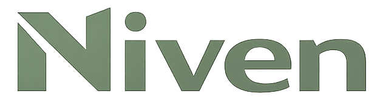

<p>
  
</p>

## Quick Start

1. Install dependencies:

```bash
pnpm install
```

2. Create a local env file from the example:

```bash
cp .env.example .env
```

3. Fill in the required Plaid Sandbox credentials in `.env`:

- `PLAID_CLIENT_ID`
- `PLAID_SECRET`
- `PLAID_ENV=sandbox`

Optional:

- `NIVEN_API_TOKEN` if you want the local API to require a bearer token
- `NIVEN_API_PORT` if you do not want to use the default `4321`

4. Pull the sample snapshot from Plaid Sandbox into the local sandbox:

```bash
pnpm sandbox:reset-from-plaid
```

5. Start the local API:

```bash
pnpm api:start
```

6. Authenticate Niven once:

```bash
pnpm harness:login
```

7. Start the chat session:

```bash
pnpm harness:chat
```

At that point you can ask things like:

- `what are my accounts and balances?`
- `show me my holdings`
- `preview moving 5.00 from account <from_account_id> to account <to_account_id>`
- `APPROVE: move 5.00 from account <from_account_id> to account <to_account_id>`

In the custom sandbox, direct cash transfers are allowed between transfer-eligible accounts, including investment accounts that maintain a cash balance.

Customize Niven's personality in [apps/harness-cli/SOUL.md](apps/harness-cli/SOUL.md).

## Branding

- `Niven-logo.png` is the square source logo used in the repository README.
- `assets/github-social-preview.jpg` is a GitHub-friendly social preview image (`1280x640`, under `1 MB`).
- To make GitHub use the social preview, upload [assets/github-social-preview.jpg](assets/github-social-preview.jpg) in `Settings -> General -> Social preview`.

## Notes

- If you want to reset the local sandbox back to the Plaid sample snapshot, run `pnpm sandbox:reset-from-plaid` again.
- If you set `NIVEN_API_TOKEN`, the harness will automatically use it from your `.env`.
- For one-off prompts instead of chat, use:

```bash
pnpm harness:prompt -- "what are my accounts and balances?"
```

## Sandbox Payday Utility

Create a synthetic deposit directly into the local wealth sandbox with:

```bash
pnpm sandbox:payday -- --amount 2400
```

By default this targets the local `Plaid Checking` account if it exists. You can also target a specific sandbox account:

```bash
pnpm sandbox:payday -- --amount 2450.75 --description "Payroll" --account <accountId>
```

This command updates the same local wealth sandbox state that `pnpm harness:chat` reads. It does not create Plaid-side transactions or mutate the separate `wealth-tools` store.
